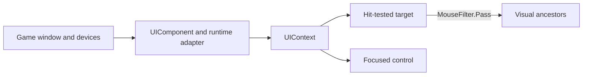

# Input and focus

`UIComponent` is the normal host adapter. It samples pointer and keyboard state, forwards the game
window's text-input stream, updates the viewport, draws the context, and installs the runtime peer's
clipboard implementation. The same QuickStart host and smoke gate exercise this path with MonoGame
and FNA.

## Pointer dispatch

Controls default to `IsHitTestVisible=true` and `MouseFilter.Stop`. `Stop` selects the topmost hit
and ends bubbling there. `Pass` allows the event to continue through visual ancestors. `Ignore`
removes that control from hit testing, but its descendants can still be hit. Call `AcceptEvent()`
to consume only the current dispatch.

The QuickStart's `LineEdit` and `Button` are retained input targets, and the button event mutates the
status label:

[!code-csharp]

## System cursors

`UIComponent` routes `Control.EffectiveCursor` to the runtime's system cursor. `LineEdit` and
`TextEdit` default to `Cursor.IBeam`, including selectable read-only text. Set `Cursor` explicitly
to override that default, or set `Cursor.Inherited` to use the parent's cursor. Other controls
continue to inherit, falling back to `Cursor.Arrow`.

`UIContext.EffectiveCursor` resolves the eligible pointer capture first (so a text selection keeps
its I-beam across other controls), then the current hit target, then Arrow. Keyboard focus does
not select a cursor. Modal boundaries, hidden/disabled/detached subtrees and hit-test filtering
are respected. Input positions are converted through `DisplayScale` exactly once by the existing
input path; cursor resolution uses logical coordinates. Custom hosts can consume this property
without invoking native APIs.

`UIComponent.SupportsSystemCursor` reports the adapter capability. MonoGame DesktopGL uses
`Mouse.SetCursor`; the native SDL runtime uses the same public API and obtains ownership checks
from its loaded `mgruntime` library. FNA.NET 2.2.11.2602 supplies `MouseCursorEXT.SetCursor` and
built-in cursors for its SDL2/SDL3 desktop backends. Browser builds, non-SDL MonoGame windows and
unavailable native focus APIs report unsupported rather than changing a global cursor blindly.
This path uses typed native delegates, not dynamic code generation, and does not own/dispose the
runtime's shared built-in cursors.

Routing requires an active game, a visible system mouse, the runtime's primary mouse window,
matching native mouse **and** keyboard focus, and a pointer inside the physical drawable area.
Capture does not authorize writes outside that window. Leaving or deactivating forgets the last
cursor without writing to another window; reentry reapplies it. Empty UI space restores Arrow.
Disabling/hiding or disposing the component restores Arrow only if it previously applied a cursor
and still owns the pointer. Native focus changes and cursor appearance still require a visible
platform acceptance test; deterministic context/router tests do not open a game window.

## Focus and keyboard

Base `Control` defaults to `FocusMode.None`; interactive controls choose stronger defaults, and
`BaseButton` defaults to `FocusMode.All`. `Click` accepts pointer focus but is omitted from tab
traversal. `All` participates in both. Use `FocusNext`/`FocusPrevious` for explicit tab order and the
four `FocusNeighbor*` properties for directional navigation. Explicit neighbors override automatic
traversal.

`UIContext.FocusedControl`, `SetFocus`, `GrabFocus`, and `ReleaseFocus` expose the retained focus
state. Keyboard commands go to that stateful tree; character composition arrives separately through
`UIContext.TextInput` and `TextComposition`. Do not derive typed text from key codes.

## Text input and clipboard

Adding `UIComponent` subscribes the correct MonoGame or FNA `RuntimeTextInputAdapter`; disposing the
component unsubscribes it. `UIContext.Clipboard` supplies `IClipboard` to `LineEdit`, `TextEdit`, and
other editing controls. A host with a custom platform layer can replace that capability, while a
single `LineEdit` can override paste through `ClipboardTextProvider`.

Run the peer-specific fixture described in [Build your first UI in C#](getting-started/csharp-first-ui.md)
to validate the full adapter rather than invoking control internals directly.

Desktop text editors support Command+C/X/V/A/Z on macOS and Control+C/X/V/A/Z on
Windows/Linux, including either side's modifier key and Shift+Command/Control+Z
for redo. Existing Control/Command aliases are retained; Alt/AltGr combinations
do not invoke editing shortcuts or interfere with printable text.

`UIComponent` binds the default clipboard to its actual runtime without replacing
an injected `IClipboard`. Native MonoGame resolves the SDL exports from its
assembly-relative `mgruntime`; DesktopGL resolves its SDL2 library on Windows,
macOS and Linux. A Native window never falls back to an unrelated SDL instance.
Access is retried after early initialization failure. SDL2's zero-success integer
and SDL3's one-byte success boolean are marshalled separately, and returned UTF-8
buffers are freed by that same SDL module. FNA uses its SDL2/SDL3 managed wrappers.
Non-SDL MonoGame windows require a host-provided clipboard.

Cut removes selections or whole caret lines only after `IClipboard.SetText`
acknowledges the write. Unavailable/rejected copy, cut or paste reports
`LineEdit.ClipboardOperationFailed` (also inherited by `TextEdit`) and a trace
warning, without changing text, selections or undo history. `CopyRequested`
remains a notification of the attempted write, not an acknowledgement: custom
hosts should supply `IClipboard`, not rely on that event to authorize deletion.
Readonly editors may copy/cut-as-copy but do not read the clipboard for paste;
password fields never export their secret. An empty available clipboard is
distinct from unavailable access.

The synchronous default clipboard contract does not implement browser permission/
asynchronous clipboard APIs. Browser hosts must supply an appropriate host bridge;
unsupported access must not pretend to succeed or discard selected text.

`ClipboardShortcutTest`, `UIContextClipboardTest` and `RuntimeClipboardTransportTest`
exercise isolated memory/native doubles, not the machine's clipboard. The optional
C ABI cases use `tests/Forma.Tests/RuntimeClipboardAbiFixture.c`: compile it as a
shared library for the runner's architecture and set `FORMA_CLIPBOARD_ABI_FIXTURE`
to its absolute path. It neither links SDL nor accesses a window or OS clipboard;
without that explicit fixture only those two ABI cases are skipped.

## Common mistakes

- `MouseFilter.Ignore` does not disable hit testing for descendants; disable or restructure the
  subtree when that is required.
- The default `Stop` can prevent an ancestor from receiving pointer behavior, including tooltip
  discovery. Choose `Pass` intentionally for transparent wrappers.
- `FocusMode.Click` is not keyboard-tab focus. Use `All` when keyboard users must reach a control.
- `AcceptEvent()` does not create a persistent capture or disable later events.

Signal Run's [settings view](https://github.com/zigrok/Forma/blob/main/samples/Forma.Xaml.Game/GameSettingsView.xaml)
shows keyboard-reachable fields, toggles, and sliders in a complete application flow.
