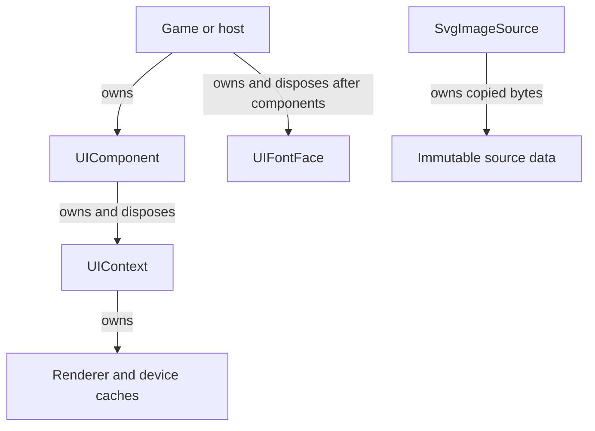

# Resource lifetime

Treat `UIContext` as the device-facing lifetime boundary. It owns roots, the renderer, theme-icon
resources, dynamic glyph pages, SVG raster caches, and compiled XAML attachment scopes.

## Context and host ownership

`UIComponent` always disposes its `UIContext`, including a context supplied to its constructor. Its
runtime text-input adapter is unsubscribed in the same operation. `UIContext.Dispose()` detaches
roots, disposes XAML scopes and renderer/icon resources, and clears text-layout state. Disposal is
not the same as removing one control: `UIContext.Remove` detaches the root but does not dispose the
control object.

This complete QuickStart host is built and executed for MonoGame and FNA; its constructor,
`LoadContent`, and `Dispose` show the ownership order:

[!code-csharp]

The game creates `UIFontFace`, while `UIComponent` owns the context. Calling `base.Dispose` first
lets game components dispose the context before the game disposes its application-owned font face.

## Fonts, SVG, and device resources

`UIFontFace` owns its backend/native face and is `IDisposable`. Keep it alive while any
`DynamicUIFont` can be used. `ThemeIcon` is a non-owning value and never disposes its texture.

`SvgImageSource.FromMemory` copies caller bytes. `FromStream` reads but does not own or dispose the
input stream. Rasterized SVG pages are device-scoped and context-owned; use
`ClearSvgRasterCache()` only between draw calls when explicit cache eviction is required. The
[runtime SVG guide](runtime-svg.md) owns provider, limit, and cache details.

The renderer, dynamic glyph atlas, and SVG raster cache subscribe to graphics-device reset and
recreate or invalidate their device objects. Do not retain atlas page textures as application-owned
resources; diagnostics return snapshots for inspection instead.

## XAML attachment lifetime

An ordinary compiled XAML root has a one-shot attachment scope. Removing it disposes bindings,
styles, and subscriptions; adding the same instance again does not reactivate them. Template
instances instead support explicit deactivate/activate recycling and final idempotent disposal.
The [template lifetime ADR](adr/0005-template-first-compatibility-and-lifetime.md)
is canonical for that distinction.

## Owned modal checkpoints

`ModalSession<T>` owns a detached popup, its compiled bindings and an optional application
lifetime. Open, accept, cancel and dispose it on the context's creation thread. Completion
follows cleanup; a cleanup failure faults completion rather than acknowledging retirement.
Reconstruction must create a fresh compiled root, not reattach a disposed instance.

`Root` identifies the owned popup. `CanInteract` is false before opening, after closing,
when hidden/detached, or as soon as cancellation is latched. A host staging a reconstructed
view must also gate its action callbacks until its own transaction is published.

`VerifyCheckpointBoundary()` is a read-only, UI-thread check for a live, correctly attached
modal with no pending cancellation or IME composition. It includes generated visual children.
It never commits/cancels composition, moves selection or changes focus to obtain a snapshot.
The host still owns local-state serialization, source identity, result/continuation policy,
and any external media lifetimes; this check does not serialize an arbitrary control tree.

## Common mistakes

- Do not dispose a context twice through competing host owners; decide whether `UIComponent` or a
  custom integration owns it.
- Do not dispose `UIFontFace` before components and contexts stop drawing with its fonts.
- Do not dispose textures obtained through `ThemeIcon` as though the icon owned them.
- Do not assume `SvgImageSource.FromStream` closes the stream or retains caller memory.
- Do not reuse a detached ordinary compiled root when live bindings or selector subscriptions are
  required.
